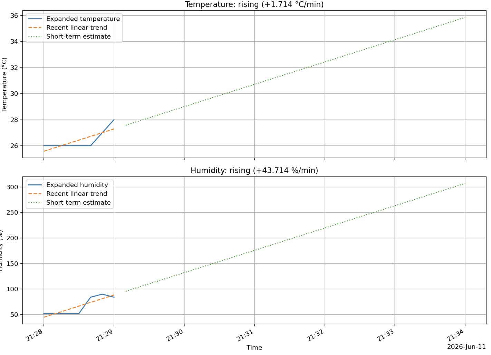
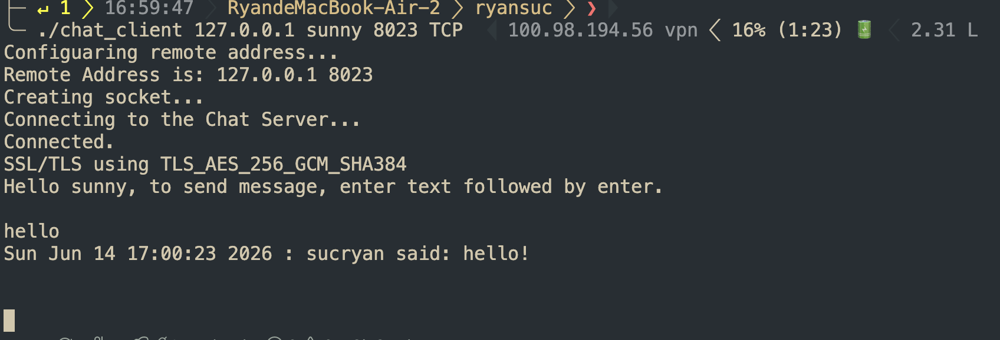
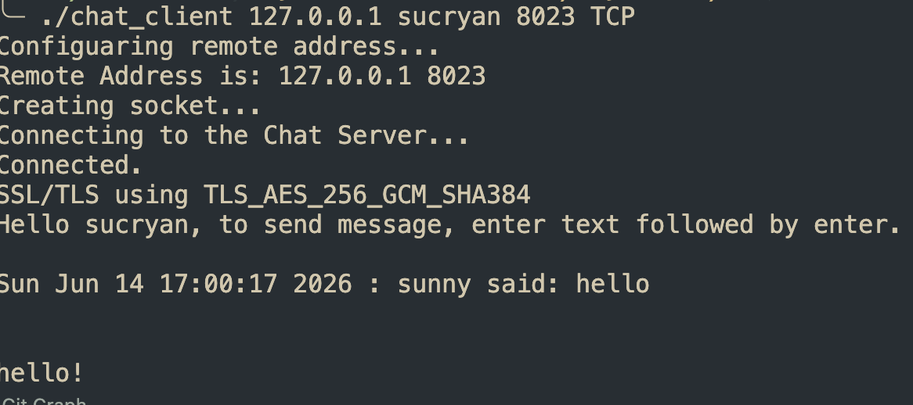
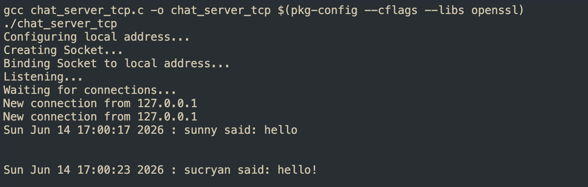
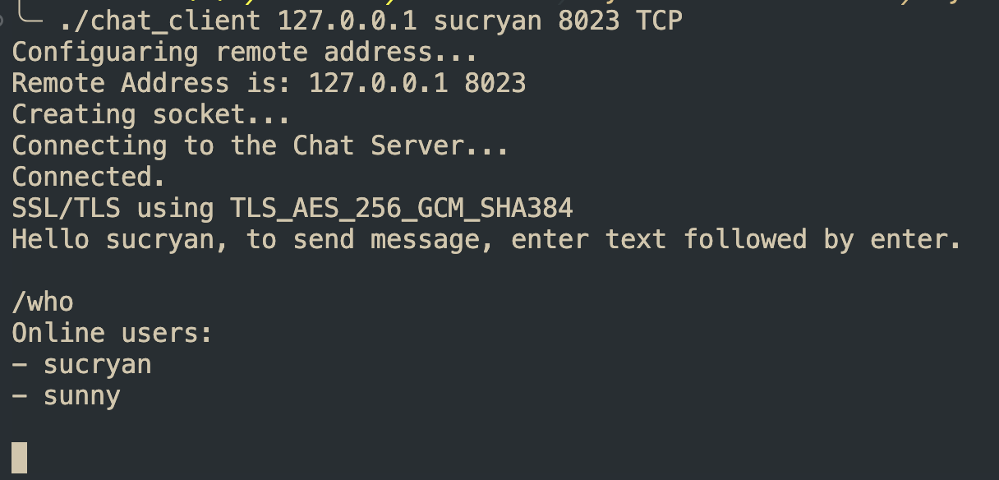

# final project readme
## Part-A
### 做法
- 我發現Part A的部分主要只要透過把老師的Animation跟client somehow給merge起來就可以。
- 然後創意的部分受到老師說的啟發，很濕出太陽，很冷出下雨emoji，我改成舒服的天氣（15~30之間，並且濕度低於70的話）就是笑臉，然後其他分別有傻眼（溫度還好但是超濕）、死亡（又熱又濕）、發抖（很冷但不濕）、哭臉（又冷又濕）、流汗（很熱但不濕）等等，有點像是表示現在是不是和出門的感覺，然後因為我不知道老師的那的bitmap要怎麼弄，於是和GPT討論最後用header引入animation的方式，並且配套一個變數叫mood，隨著判斷條件不同而改變表情包。
### Reference
- 附上與GPT的聊天記錄，用來證明完成作業的過程是以輔助而非直接程式碼生成。https://chatgpt.com/share/6a2935c8-d108-83a7-b478-fb75820820ab
- 影片
    - https://youtube.com/shorts/72NLXSaexM0?si=0Ud74ufdGIovzgvG

## Part-B
- 這部分則是我發現其實微調TempServer並且參考push temperature那份就可以做了，把WiFi AP功能保留，並且設定他為client而非server，然後參考0515上課的那個http_server，把get改成post就好了。
- 然後創意的部分我額外拉了一個python的function，讓他透過讀取csv去用matplot生成線圖，做回歸直線，然後並且因為csv時間會斷開，我就讓他的機制是可以將中間斷開的時間視為代表那段都是持續那個溫度和溼度，然後額外拉一個機制叫做extented to now，因為最後一筆不一定是真的持續到現在，而是可能感測器關掉了。
    - 
### Reference
- 同樣附上GPT的聊天記錄https://chatgpt.com/share/6a2e42bb-ad38-83e8-8e9a-233f6320b628

## Part-C
- 這個part我雖然概念相對單純，但是要改code真的蠻複雜的，以下是成功的截圖，可以看到兩方都可以正確的收到訊息。
    - 
    - 
- 後台也可以看到各個人傳送的資訊
    - 
- 創意
    - 實作/who的功能，也就是一個使用者可以發給server的指令，讓他知道現在有誰在線上。
        - 
### Reference
- 聊天記錄：https://chatgpt.com/share/6a2e7141-0afc-83e8-9a4c-f0b9b0278bfe